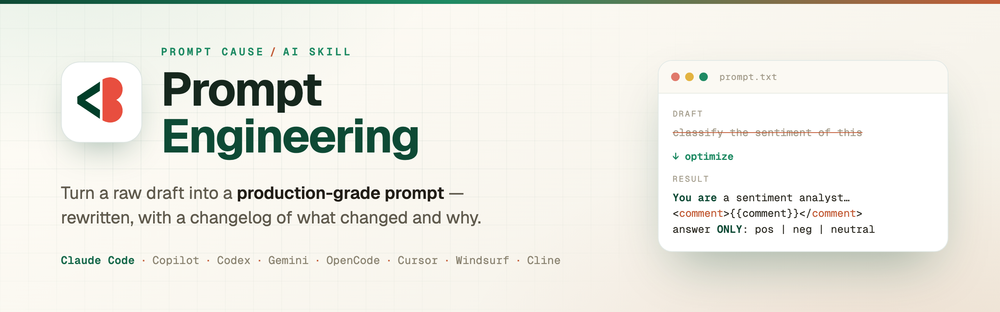

<div align="center">



<br><br>

**An AI skill that turns a raw draft into a production-grade prompt.**

It rewrites and optimizes prompts using proven techniques, then hands you a ready-to-paste result plus a short changelog of what changed and why — calibrated to your task type and target model.

[](LICENSE)
[](https://github.com/PhAlves23/prompt-engineering-skill/actions/workflows/validate.yml)
[](https://github.com/PhAlves23/prompt-engineering-skill/releases)
[](CONTRIBUTING.md)

Works with **Claude Code · GitHub Copilot · OpenAI Codex · Gemini CLI · OpenCode · Cursor · Windsurf · Cline**

</div>

---

## Table of contents

- [Why this skill](#why-this-skill)
- [How it works](#how-it-works)
- [Example](#example)
- [Installation](#installation)
- [Verify installation](#verify-installation)
- [Usage](#usage)
- [What's inside](#whats-inside)
- [Updating](#updating)
- [Uninstall](#uninstall)
- [Contributing](#contributing)
- [Project structure](#project-structure)
- [License](#license)

---

## Why this skill

Most prompt advice is a handful of generic tips. This skill is different in three ways:

- **Grounded in primary sources.** Every technique is traceable to a cited source — Anthropic's prompting best practices and prompt improver, OpenAI's GPT-5/reasoning guides, Google's Gemini PTCF, and *The Prompt Report*'s academic taxonomy of 58 techniques. See [`sources.md`](plugins/prompt-engineering/skills/prompt-engineering/references/sources.md).
- **Model-aware.** The rules differ by model family. The skill adapts to Claude 4.x, OpenAI GPT/reasoning (o-series), and Gemini — e.g. it removes "think step by step" for reasoning models, which actively hurts them.
- **Anti-overengineering.** It calibrates effort to complexity. A simple prompt gets a lean rewrite; it won't bloat it with chain-of-thought and examples it doesn't need.

> It **improves the prompt** — it does not run it, unless you explicitly ask.

## How it works

You paste a draft (or describe what you want). The skill runs a five-phase workflow:

1. **Diagnose** — real intent, task type, target model, audience, output format, constraints, and the draft's weaknesses.
2. **Select techniques** — only those that add value for this task and model.
3. **Rewrite** — assemble the prompt in a canonical structure (role, context+motivation, XML-tagged data, positive instructions, few-shot, output contract).
4. **Self-review** — run a quality checklist; the golden test is "could a colleague with no context run this without doubt?"
5. **Deliver** — the optimized prompt + a changelog mapping each change to the weakness it fixes.

## Example

<table>
<tr>
<th>Your draft (before)</th>
<th>After the skill</th>
</tr>
<tr>
<td valign="top">

```
classify the sentiment
of this comment:
{{comment}}
```

</td>
<td valign="top">

```
You are a sentiment analyst
specialized in customer feedback.

Classify the sentiment of the comment
below into one of these categories:
positive, negative, neutral.

<comment>
{{comment}}
</comment>

Follow these steps:
1. Identify expressions that carry emotion.
2. Weigh the overall tone, accounting
   for irony and negation.
3. Choose the predominant sentiment.

Put your reasoning in <analysis>. On the
last line, answer ONLY one word:
positive, negative, or neutral.
```

</td>
</tr>
</table>

**What the skill changed, and why:** added a **role** (calibrates interpretation), a strict **enum output contract** (`ONLY one word` — parseable), a short **chain-of-thought** (catches irony/negation, the top error source in sentiment), and **XML** around the input (robust to comments with line breaks). Every rewrite ships with this changelog.

See six more cases — coding, extraction, research, agentic, long-context, and an already-good prompt — in [`worked-examples.md`](plugins/prompt-engineering/skills/prompt-engineering/references/worked-examples.md).

## Installation

Pick your tool. Claude Code is the primary target; the rest are fully supported.

<details open>
<summary><b>Claude Code</b></summary>

**One-line installer** (copies the skill into `~/.claude/skills/`, backs up any existing install, touches nothing else):

```bash
curl -fsSL https://raw.githubusercontent.com/PhAlves23/prompt-engineering-skill/main/install.sh | bash
```

**Or as a plugin** (versioned, updatable):

```
/plugin marketplace add PhAlves23/prompt-engineering-skill
/plugin install prompt-engineering
```

Restart Claude Code after installing.
</details>

<details>
<summary><b>GitHub Copilot CLI</b></summary>

The plugin marketplace works in Copilot CLI too:

```bash
copilot plugin marketplace add PhAlves23/prompt-engineering-skill
copilot plugin install prompt-engineering@prompt-engineering-marketplace
```
</details>

<details>
<summary><b>OpenAI Codex</b></summary>

Codex discovers the full skill from `~/.agents/skills/`. Full guide: [`docs/INSTALL.codex.md`](docs/INSTALL.codex.md).

```bash
git clone https://github.com/PhAlves23/prompt-engineering-skill.git ~/.codex/prompt-engineering-skill
mkdir -p ~/.agents/skills
ln -s ~/.codex/prompt-engineering-skill/plugins/prompt-engineering/skills/prompt-engineering ~/.agents/skills/prompt-engineering
```
</details>

<details>
<summary><b>Gemini CLI</b></summary>

```bash
gemini extensions install https://github.com/PhAlves23/prompt-engineering-skill
```
</details>

<details>
<summary><b>OpenCode</b></summary>

Reads `AGENTS.md` natively. Quickest path (full guide: [`docs/INSTALL.opencode.md`](docs/INSTALL.opencode.md)):

```bash
curl -fsSL https://raw.githubusercontent.com/PhAlves23/prompt-engineering-skill/main/adapters/codex/AGENTS.md -o AGENTS.md
```
</details>

<details>
<summary><b>Cursor / Windsurf / Cline</b></summary>

Copy the rule for your tool from [`adapters/`](adapters/):

- **Cursor** → `adapters/cursor/.cursor/rules/prompt-engineering.mdc` into your project's `.cursor/rules/` (invoke with `@prompt-engineering`). A native Cursor plugin manifest is also provided at `.cursor-plugin/plugin.json`.
- **Windsurf** → `adapters/windsurf/.windsurf/rules/prompt-engineering.md` into `.windsurf/rules/` (activates by intent).
- **Cline** → `adapters/cline/.clinerules/prompt-engineering.md` into `.clinerules/prompt-engineering.md` (workspace rule; ask explicitly).

See [`adapters/README.md`](adapters/README.md) for details and other tools (Roo, Continue, Zed).
</details>

## Verify installation

Start a new session and ask for something that should trigger the skill — for example, paste a draft with "improve this prompt", or run `/prompt-engineering` in Claude Code. You should get an optimized prompt + a changelog.

```bash
# Claude Code / curl install:
test -f ~/.claude/skills/prompt-engineering/SKILL.md && echo "installed" || echo "not found"
```

## Usage

Type `/prompt-engineering` (Claude Code / Copilot), or simply say:

- "improve this prompt"
- "optimize this prompt"
- "rewrite this prompt"
- or paste a draft and ask to make it better.

The skill activates automatically (where the tool supports intent-based activation) and returns the rewritten prompt plus a changelog.

## What's inside

| Component | What it gives you |
|-----------|-------------------|
| **Canonical structure** | Role, context+motivation, sequential instructions, XML, few-shot, CoT, output contract, success criteria |
| **Technique selection** | By task type (classification, extraction, generation, coding, reasoning, research, agentic, summarization) and model |
| **Technique index** | All 58 techniques from *The Prompt Report* plus vendor/post-2024 extras |
| **Worked examples** | 7 full draft → optimized → changelog cases |
| **Quality checklist** | Pre-delivery self-review |
| **Evaluation guide** | How to A/B test that the rewrite is actually better |
| **Prompt security** | Defenses against injection/jailbreak |
| **Auto-optimization** | APE, OPRO, DSPy, MIPRO references for when you have an eval set |

## Updating

| Install method | Update command |
|----------------|----------------|
| curl installer | re-run the installer |
| Claude / Copilot plugin | `/plugin update prompt-engineering` |
| Codex symlink | `cd ~/.codex/prompt-engineering-skill && git pull` |
| Gemini extension | `gemini extensions update prompt-engineering` |

## Uninstall

- curl / manual: `rm -rf ~/.claude/skills/prompt-engineering`
- Claude plugin: `/plugin uninstall prompt-engineering`
- Codex: `rm ~/.agents/skills/prompt-engineering`

## Contributing

Issues and pull requests are welcome. Start with [CONTRIBUTING.md](CONTRIBUTING.md) — it covers the dev setup, how the adapters are generated from a single source, and the review process. Please also read the [Code of Conduct](CODE_OF_CONDUCT.md). Security reports go through [SECURITY.md](SECURITY.md).

The skill stays grounded in cited sources: **if you change a technique claim, cite it.**

## Project structure

```
prompt-engineering-skill/
├── plugins/prompt-engineering/        # the Claude Code plugin
│   └── skills/prompt-engineering/     # the skill itself (source of truth)
│       ├── SKILL.md                   # entry point + workflow
│       ├── references/                # technique catalog, model profiles, examples, etc.
│       └── assets/                    # canonical XML template
├── adapters/                          # other-tool versions (generated from _core.md)
│   ├── _core.md                       # single source for the lean adapter body
│   ├── cursor/  windsurf/  copilot/  codex/
│   └── README.md
├── scripts/build-adapters.sh          # regenerate adapters from _core.md
├── docs/                              # per-platform install guides + website snippets
├── .github/                           # CI, issue/PR templates, funding
├── .claude-plugin/marketplace.json    # Claude Code / Copilot marketplace
├── .cursor-plugin/plugin.json         # native Cursor plugin manifest
├── gemini-extension.json + GEMINI.md  # Gemini CLI extension
├── install.sh                         # one-line curl installer
├── CHANGELOG.md  CONTRIBUTING.md  CODE_OF_CONDUCT.md  SECURITY.md  LICENSE
```

## License

[MIT](LICENSE) — free to use, modify, and redistribute with attribution.
